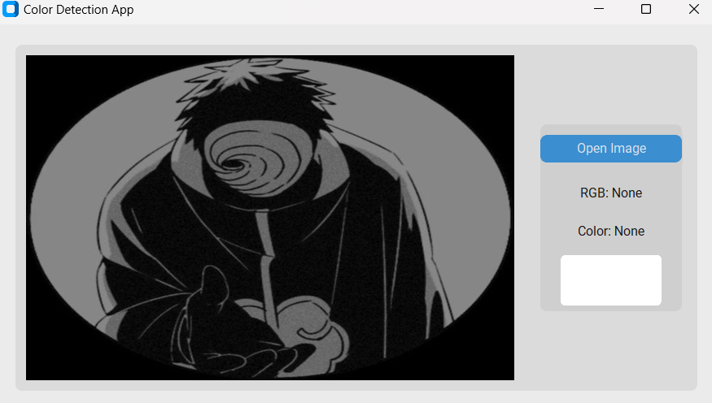

# 🎨 Image Color Detection App

A simple desktop GUI application that allows users to upload an image, click anywhere on the image, and get the closest color name along with its RGB values. Built using Python, `customtkinter`, and `Pillow`.

---

## 📸 Features

- 📂 Load `.png`, `.jpg`, or `.jpeg` images.
- 🖱 Click anywhere on the image to detect the color at that pixel.
- 🎯 Get the closest color name from a CSV dataset.
- 🌈 Display RGB values and a preview box of the detected color.

---

## 🧰 Tech Stack

- [Python 3.8+](https://www.python.org/)
- [customtkinter](https://github.com/TomSchimansky/CustomTkinter)
- [tkinter](https://docs.python.org/3/library/tkinter.html)
- [pandas](https://pandas.pydata.org/)
- [Pillow](https://python-pillow.org/)

---

## 🚀 Getting Started

### 1. Clone the repository

```bash
git clone https://github.com/yourusername/color-detection-app.git
cd color-detection-app
```
### 2. Install dependencies
```
pip install customtkinter pandas pillow
```
### 3.Run the app
```
python app.py
```
---

## Screenshots

<p align="center">
  
</p>

<p align="center">
  
</p>
